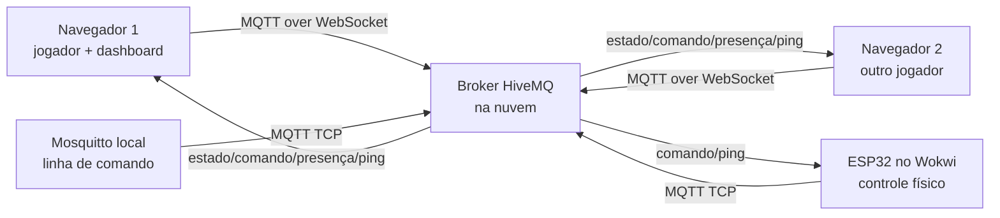

# Circle Arena

O Circle Arena é um jogo multiplayer simples feito para demonstrar comunicação MQTT entre navegador, outro navegador e um ESP32 simulado no Wokwi.

## Integrantes

- Antônio Carlos
- Bruno Lucas dos Santos
- Breno Benítez Falqueiro
- Eduardo do Prado Pereira
- Túlio Henrique Santos Gonçalves

## Tema escolhido

Escolhemos o tema de jogo multiplayer distribuído porque ele deixa a troca de mensagens mais fácil de visualizar. Em vez de mostrar só números de sensores, cada mensagem MQTT altera alguma coisa na arena: posição, presença, comando, pontuação ou resposta do ESP32.

A ideia do jogo é parecida com Agar.io: cada jogador controla uma bolinha, coleta energia para crescer e pode engolir bolinhas menores. O ESP32 no Wokwi funciona como um controle físico, usando botões para publicar comandos no broker.

## Links da entrega

- Repositório público: https://github.com/BrunoLucas07/circle-arena
- Aplicação hospedada: https://sistemasmultimidiaedistribuidosv2.netlify.app
- Projeto Wokwi público: https://wokwi.com/projects/465860472531533825

## Arquitetura



O navegador conversa com o broker usando MQTT over WebSocket, porque navegador não abre conexão MQTT TCP direta. O ESP32 usa MQTT TCP normal com a biblioteca PubSubClient. O Mosquitto entra como ferramenta de teste local, publicando e assinando tópicos no mesmo broker usado pela aplicação.

## Tecnologias e bibliotecas

- HTML, CSS e JavaScript puro: escolhemos essa base porque o projeto não precisava de backend e assim fica fácil hospedar em Netlify.
- Canvas 2D: usado para desenhar a arena, bolinhas, energia e obstáculos em tempo real.
- MQTT.js: cliente MQTT no navegador, com suporte a WebSocket.
- ESP32 no Wokwi: usado como dispositivo embarcado simulado.
- PubSubClient: biblioteca MQTT usada no código do ESP32.
- Mosquitto: usado nos testes de linha de comando.
- HiveMQ público: usado como broker na nuvem, por aceitar conexões pela internet e permitir teste rápido com WebSocket e TCP.

## Como rodar

Para testar a interface, basta abrir a aplicação hospedada:

```txt
https://sistemasmultimidiaedistribuidosv2.netlify.app
```

Também é possível abrir `index.html` localmente. No modo local, o jogo funciona sem MQTT. Para testar a parte distribuída, clique em `Conectar`, mantenha a sala `circle-arena-demo` e abra a mesma aplicação em outro navegador.

Broker usado por padrão:

```txt
wss://broker.hivemq.com:8884/mqtt
```

A interface também tem campos de usuário e senha. Eles ficaram prontos caso seja usado um broker autenticado, como HiveMQ Cloud ou EMQX Cloud.

## Tópicos MQTT

Organizamos os tópicos partindo de uma raiz comum:

```txt
n461/circle-arena/circle-arena-demo
```

| Tópico | QoS | Retain | Por que usamos |
|---|---:|---:|---|
| `n461/circle-arena/circle-arena-demo/jogadores/<id>/estado` | 0 | sim | Envia posição, cor, tamanho e pontuação. É uma mensagem frequente; se uma atualização se perder, outra chega logo depois. O retained ajuda quem entra depois a receber o último estado conhecido. |
| `n461/circle-arena/circle-arena-demo/jogadores/<id>/comando` | 1 | não | Usado para comandos de movimento e ações, inclusive comandos vindos do ESP32. Preferimos QoS 1 porque comando perdido atrapalha mais que estado perdido. |
| `n461/circle-arena/circle-arena-demo/jogadores/<id>/presenca` | 1 | sim | Indica se navegador ou ESP32 está online/offline. Usamos retained para guardar o último status e LWT para avisar queda inesperada. |
| `n461/circle-arena/circle-arena-demo/telemetria/ping` | 0 | não | Mede latência com ping/pong. Como é só telemetria temporária, QoS 0 já é suficiente. |

## Wildcards

Usamos `+` nas assinaturas principais:

```txt
n461/circle-arena/circle-arena-demo/jogadores/+/estado
n461/circle-arena/circle-arena-demo/jogadores/+/comando
n461/circle-arena/circle-arena-demo/jogadores/+/presenca
```

O `+` substitui apenas um nível do tópico, que no nosso caso é o ID do jogador. Assim a interface recebe todos os jogadores, mas continua separando estado, comando e presença.

Não usamos `#` na lógica principal porque ele assinaria tudo dali para baixo. Por exemplo, `n461/circle-arena/circle-arena-demo/#` receberia estado, comando, presença, ping e qualquer outro tópico futuro. Isso é útil para depuração no MQTT Explorer ou Mosquitto, mas no código da aplicação preferimos `+` para manter cada tipo de mensagem mais organizado.

## Recursos avançados MQTT

Usamos dois recursos além do publish/subscribe básico:

- Retained messages: usadas em `estado` e `presenca`, para que clientes novos recebam a última informação conhecida.
- Last Will and Testament: configurado no navegador e no ESP32. Se algum cliente desconectar de forma inesperada, o broker publica uma mensagem `offline` no tópico de presença.

## Interface web

A interface funciona como publisher e subscriber ao mesmo tempo. Ela publica estado, comando, presença e ping, e também assina os tópicos dos outros jogadores.

No painel de telemetria, a caixa `Última mensagem` mostra o último payload MQTT em formato de console. Isso ajuda na apresentação porque dá para mostrar exatamente o JSON que está trafegando pelo broker.

## ESP32 no Wokwi

O ESP32 simulado participa da lógica usando o broker real. Os botões publicam comandos MQTT no tópico de comando, e o LED indica mensagens recebidas. Ele também assina o tópico de ping e responde com `pong`.

Como o projeto usa Wokwi, o link público do simulador está na seção de links da entrega.

## Testes

Os testes com Mosquitto, MQTT Explorer e comandos de linha de comando estão em:

```txt
docs/testes.md
```

Esses testes servem para provar que o broker está na nuvem e que um cliente local consegue publicar/assinar mensagens usadas pela aplicação. O arquivo também explica o que cada comando faz, incluindo `mosquitto_sub`, `mosquitto_pub`, `+`, `#`, QoS e retained message.

## Decisões do projeto

As justificativas das escolhas técnicas estão em:

```txt
docs/decisoes-do-projeto.md
```

Esse material explica por que usamos JavaScript puro, Canvas 2D, MQTT.js, HiveMQ, Wokwi, Mosquitto e Netlify, além de resumir as partes principais do código.

## Deploy

O deploy foi feito no Netlify porque o projeto é estático. Como não existe backend nem etapa de build, o Netlify só publica a raiz do repositório.

Link da aplicação:

```txt
https://sistemasmultimidiaedistribuidosv2.netlify.app
```

## Apresentação

O roteiro dividido entre Antônio Carlos, Bruno Lucas dos Santos, Breno Benítez Falqueiro, Eduardo do Prado Pereira e Túlio Henrique Santos Gonçalves está em:

```txt
docs/apresentacao.md
```

Ele inclui a ordem da fala, explicação do código, sequência de demonstração e possíveis respostas para perguntas do professor.

## Explicação completa do código

Para estudar o código antes da apresentação, use:

```txt
docs/explicacao-completa-codigo.md
```

Esse arquivo mostra onde ficam as principais partes do projeto e traz uma tabela com linhas, código e explicação.
